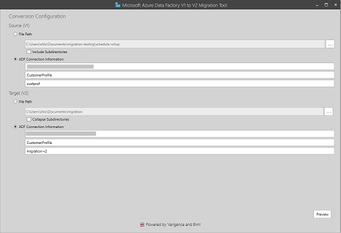

The ADF V1 to V2 Migration Tool assists in converting your V1 data factories to V2 entities. See [documentation](https://docs.microsoft.com/en-us/azure/data-factory/compare-versions) for more on the differences between V1 and V2, but ADF V2 offers richer control flow, authoring, and monitoring capabilities.

# Contents
1. [What's different in V2?](#V2different)
2. [Logging issues](#issues)
3. [FAQ](#faq)

## What's different in V2? What scenarios are not currently supported? 

Currently, because of the change in the app model from V1 and V2, certain features in V1 are modeled differently. Here are the features that are currently not supported in ADF V2. Keep note of what scenarios your entities follow, as the migration tool will not convert these properties. 

### Datasets

|   | V1 | V2 |
| --- | --- | --- |
| Dataset - Availability | Dataset availability defines the processing window model for the dataset (frequency, interval, style, anchorDateTime, offset) | In V2, availability is no longer on the dataset level. If a pipeline references datasets with different availabilities, the migration tool will split the pipeline accordingly to group datasets together that were on the same schedule in V1. Each pipeline will have an associated trigger resource based on the schedule of the dataset(s) it corresponds to |
| Dataset - Policy (ExternalData) | Allowed users to run pipelines based on when a dataset &quot;arrives&quot; on a tumbling window slice. Also allowed for configuration on dataDelay, retry Interval, retryTimeout, maximumRetry | There is no good story for external datasets in V2 currently, however we plan to support this scenario end of June. A workaround involves using GetMetadata activity, however the migration tool will currently ignore the property |
| Dataset - Policy (Validation)| Allowed users to check on minimumsizeMB or minimumRows | In V2, this is achievable through using the Lookup Activity or Get Metadata activity with a If activity, however not currently accommodated in the Migration Tool. |
| Dataset Types (Internal) | Cosmos | For Cosmos, we have the Scope activity, however any Cosmos copy is expected to land end of June. |

### Activities

|   | V1 | V2 |
| --- | --- | --- |
| Activity - Scheduler | Execution scheduling for the activity | Activities cannot be separately scheduled in V2. Pipelines are the only entities that can be scheduled, with a trigger. If a pipeline contains activities with multiple schedules, the migration tool will split up the pipelines by activities with the same schedule. |
| Activity - Policy (executionPriorityOrder) | Determines the ordering of data slices that are being processed, default is OldestFirst | ADF V2 only supports &quot;OldestFirst&quot; |
| Activity – Policy (delay, longRetry, concurrency) | Specifying delay before processing of the activity and long Retries (before retry attempts, non-transient) | ADFV2 does not support activity window delay or longRetry |
| DotNet Activity | DotNet Activity was implemented by creating a .Net Class Library project with a class that implements the Execute method of the IDotNetActivity interface. The Linked Services, Datasets, and Extended Properties in the JSON payload of a (Custom) DotNet Activity are passed to the execution method as strongly-typed objects. For details about the version 1 behavior, see (Custom) DotNet in version 1. Because of this implementation, your version 1 DotNet Activity code has to target .Net Framework 4.5.2. The version 1 DotNet Activity also has to be executed on Windows-based Azure Batch Pool nodes. | In the Azure Data Factory V2 Custom Activity, you are not required to implement a .Net interface. You can now directly run commands, scripts, and your own custom code, compiled as an executable. To configure this implementation, you specify the Command property together with the folderPath property. The Custom Activity uploads the executable and its dependencies to folderpath and executes the command for you. Because of the change in structure, the migration tool cannot auto-convert this activity. Refer [here](https://docs.microsoft.com/en-us/azure/data-factory/transform-data-using-dotnet-custom-activity#compare-v2-v1) for more information in how to convert your V1 DotNet activity to V2 Custom activity.|

### Pipelines

|   | V1 | V2 |
| --- | --- | --- |
| Pipeline - Paused | In V1, if it's true, pipeline does not run | ADF V2 does not allow pausing on pipelines. You can however, start and stop the trigger associated with the pipeline accordingly. |
| Pipeline - Scheduling | In V1, there were many frequencies your pipeline could run at -- hourly, weekly, monthly | There are different types of triggers in V2. The migration tool by default creates tumbling window triggers, which allows for backfill. The available frequencies are minutes and hourly, so your **monthly** frequencies are calculated based on average days in a month from hours. The schedule trigger allows for more complex calendar scheduling scenarios, but does not allow for backfill scenarios. See [here](https://docs.microsoft.com/en-us/azure/data-factory/concepts-pipeline-execution-triggers#trigger-type-comparison) for more explanation on tumbling window vs. schedule trigger|

### Scenarios

|   | V1 | V2 |
| --- | --- | --- |
| Gateway and On-Prem Copy | V1 uses Data Management Gateway to connect to on-premises machines | ADF V2's equilvanet is an Integration Runtime, which you will need to create. The Migration Tool will not create this by default. See this [tutorial](https://docs.microsoft.com/en-us/azure/data-factory/tutorial-hybrid-copy-portal) on how to create a self-hosted integration runtime |
| Schedule Roll-up | Scenario where pipelines with different cadences can fan into a third pipeline. | ADF V2 will currently break your pipelines if the activities/datasets are on different frequencies. We will fully support this scenario in June |
| Activity Limits | V1 did not have an activity limit for pipelines, just size (200 MB) | ADF V2 supports maximum of 40 activities. Migration tool will split pipelines by 40 activities. |

## How do I log issues? 

The migration tool allows for direct feedback to be submitted in the tool itself. 

However, to see known issues and file your own as part of the community, create an issue on this repository. We will be actively monitoring the issues logged and responding with ETA's of a fix. **Submit your issues [here](https://github.com/azuredatafactoryv2/v1tov2migration/issues)**

The process is to first outline the issue you're hitting, JSON snippets are always helpful for us to re-pro the issue on our side.

Add a label to the issue indicating it's type: e.g. bug, question, enhancement.

Once your issue is acknowledged and fixed, we'll be applying a "Fixed" label accordingly.

Once the "Fixed" label is attached by us, validate the fix, and close the issue.

## FAQ 

**1. How do I edit my linked service credentials?**

The migration tool will not pull your V1 linked service connection strings because of security reasons so you must manually edit your credentials in V2. To do so, login to your V2 data factory from Azure Portal. Click the "Author & Monitor" pane.

Once the experience loads, click the "Author" icon in the left tab.

Click on "Connections"

Edit your linked services one-by-one

Input your credentials

**2. How do I start a run?**

Once your linked services are updated, we've created tumbling window triggers for you. Similar to #1 (editing your linked services), open the authoring experience. From there, click "Triggers"

In your trigger, there are two important things to edit. First, change your "StartTime." It's important that this does not duplicate whatever your V1 pipeline is doing, as a tumbling window trigger will do a backfill from the StarTime. We recommend first pausing your V1 pipeline, and changing the StartTime to whatever the current time is. The current StartTime is set to the time the migration tool was used. Second, make sure to click "Activate." This explicitly starts your trigger. When you create a trigger, it will not trigger anything until you explicitly start it. Vice versa, you can also stop your trigger at anytime.

**3. Do I have to use a tumbling window trigger?**

There are different types of triggers in V2. The migration tool by default creates tumbling window triggers, which allows for backfill. The available frequencies are minutes and hourly, so your **monthly** frequencies are calculated based on average days in a month from hours. The schedule trigger allows for more complex calendar scheduling scenarios, but does not allow for backfill scenarios. See [here](https://docs.microsoft.com/en-us/azure/data-factory/concepts-pipeline-execution-triggers#trigger-type-comparison) for more explanation on tumbling window vs. schedule trigger
